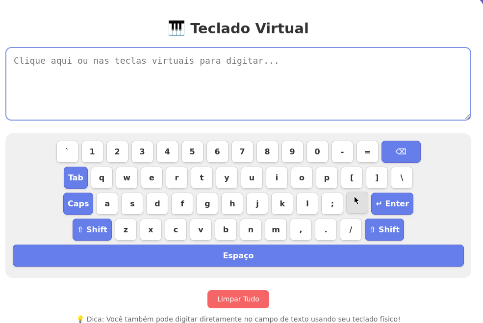

# 🎹 Teclado Virtual

Um teclado virtual interativo e responsivo desenvolvido em HTML, CSS e JavaScript puro.

## ✨ Funcionalidades

- **Teclado virtual completo** com layout semelhante ao teclado QWERTY
- **Suporte a Caps Lock** e **Shift** (com destaque visual quando ativados)
- **Sincronização com teclado físico**: você pode digitar normalmente no campo de texto
- **Tratamento inteligente de caracteres especiais** (`! @ # $ % ^ & * ( ) _ + { } : " < > ? | ~`)
- **Teclas especiais funcionais**:
  - Backspace (⌫)
  - Enter (↵)
  - Tab
  - Espaço
  - Caps Lock
  - Shift (com timeout automático)
- **Responsivo** — funciona bem em celulares e tablets
- **Interface moderna** com animações suaves e design clean
- **Botão para limpar todo o texto**

## 📸 Preview

## 🚀 Como usar

1. Baixe ou clone este repositório
2. Abra o arquivo **`terclado_virtual.html`** em qualquer navegador moderno (Chrome, Firefox, Edge, Safari)
3. Comece a digitar!

Você pode:
- Clicar nas teclas do teclado virtual
- Ou digitar normalmente usando o **teclado físico**

## 🛠️ Tecnologias Utilizadas

- HTML5
- CSS3 (com Flexbox e Media Queries)
- JavaScript Vanilla (sem frameworks)

## 📁 Estrutura de Arquivos

## 🎨 Características Técnicas

- Design totalmente responsivo
- Sem dependências externas
- Acessível (foco mantido no textarea)
- Animações suaves de clique e hover
- Gerenciamento correto de cursor e seleção de texto
- Suporte a múltiplas linhas (Enter)

## 📱 Compatibilidade

- Desktop
- Tablets
- Celulares (Android e iOS)

Testado nos principais navegadores.

## 📝 Possíveis Melhorias (Futuras)

- Suporte a layouts internacionais (AZERTY, QWERTZ, etc.)
- Tema escuro
- Som de teclas (opcional)
- Teclas de atalho (Ctrl, Alt, etc.)
- Modo tela cheia

---

**Feito com ❤️ por [yvesoπ]**

Se gostou do projeto, deixe uma ⭐ no repositório!
